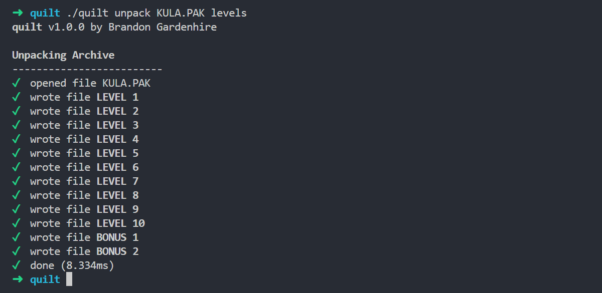

<h4 align="center">
    <a href="https://github.com/KulaWorkshop/Quilt/releases">Releases</a> |
    <a href="https://docs.kula.quest/tools/quilt">Documentation</a>
</h4>

<div align="center">

# Quilt

[](https://opensource.org/licenses/MIT)




</div>

**Quilt** is a command-line tool that can extract and create archive files from Kula Quest, such as **.PAK** and **.KUB** files.
It can also decompress and compress files using the [LZRW3-A](http://www.ross.net/compression/lzrw3a.html) algorithm used in the earliest release of the game.

A more detailed explanation is available [here](https://docs.kula.quest/tools/quilt).

## Installation

You can download the latest release from the [releases page](https://github.com/KulaWorkshop/Quilt/releases).

## Usage

To extract an archive file, use the **unpack** command followed by the path to the file and an output folder for its contents.
The following example command will extract the files inside of `HIRO.PAK` into a folder called `levels`:

```bash
$ quilt unpack HIRO.PAK levels
```

To create an archive, use the **pack** command followed by the path to create it and a list of files to use:

```bash
$ quilt pack LEVELS.PAK LEVEL_1 LEVEL_2 LEVEL_3
```

By default, Quilt will create a **.PAK** file.
Use the `-k` flag to set the creation type to **.KUB**:

```bash
$ quilt pack LEVELS.KUB -k LEVEL_1 LEVEL_2 LEVEL_3
```

### Text File

When dealing with archives that contain many files, or for quick rebuilding of an archive after making adjustments to its contents, you can use a text file containing the files that you would like to use and their order.
You can generate this text file automatically when unpacking an archive, using the `-s` flag:

```bash
$ quilt unpack -s HIRO.PAK levels
```

This example command will unpack the contents of `HIRO.PAK`, and will additionally save a text file inside of the `levels` folder named `HIRO.PAK.txt`:

```
LEVEL 1
LEVEL 2
LEVEL 3
LEVEL 4
LEVEL 5
LEVEL 6
LEVEL 7
LEVEL 8
LEVEL 9
LEVEL 10
LEVEL 11
LEVEL 12
LEVEL 13
LEVEL 14
LEVEL 15
BONUS 1
BONUS 2
BONUS 3
HIDDEN 1
LESSON
```

> The text file format is simple - one filename per line, in the order they should appear in the archive.

Instead of having to specify all of these files to build an archive, you can use the **@** parameter following the path of the text file:

```bash
$ quilt pack HIRO.PAK @levels/HIRO.PAK.txt
```

> [!IMPORTANT]
> Make sure that your files are inside the same folder as the text file.

### Alpha Compression

In the first demo of the game, the [.TGI](https://docs.kula.quest/formats/tgi) and [.GGI](https://docs.kula.quest/formats/ggi) files are both fully compressed using the [**lzrw3a**](http://www.ross.net/compression/lzrw3a.html) algorithm.
Quilt allows you to decompress and recompress these files using the following examples below.

For decompression, the following commands can be used:

```bash
$ quilt decompress KULA.TGI KULA.decompressed.TGI
$ quilt decompress KULA.GGI KULA.decompressed.GGI
```

If you would like to recompress the file to put it back into the game, the following commands can be used:

```bash
$ quilt compress KULA.decompressed.TGI KULA.TGI
$ quilt compress KULA.decompressed.GGI KULA.GGI
```

## Credits

Developed by **[SaturnKai](https://saturnkai.dev/)**. Additionally, this tool also uses the **LZRW3-A** compression algorithm written by **[Ross N. Williams](http://www.ross.net/compression/)**.

## Changelog

**Version 1.0.0 (2025-09-14)**

-   Initial release.
